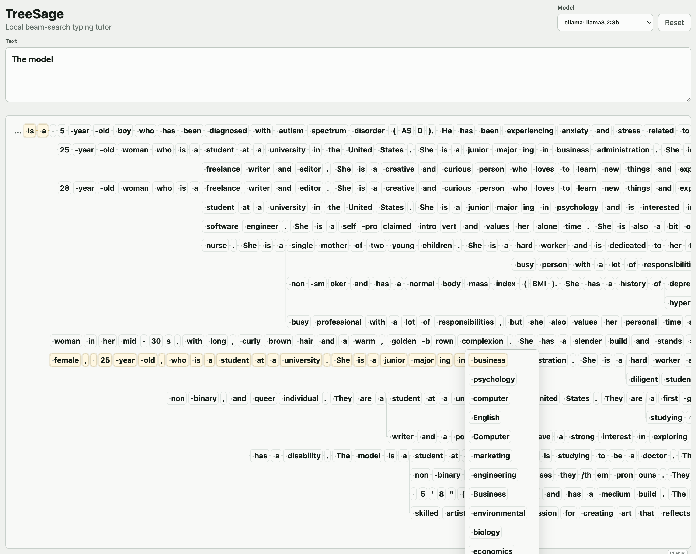
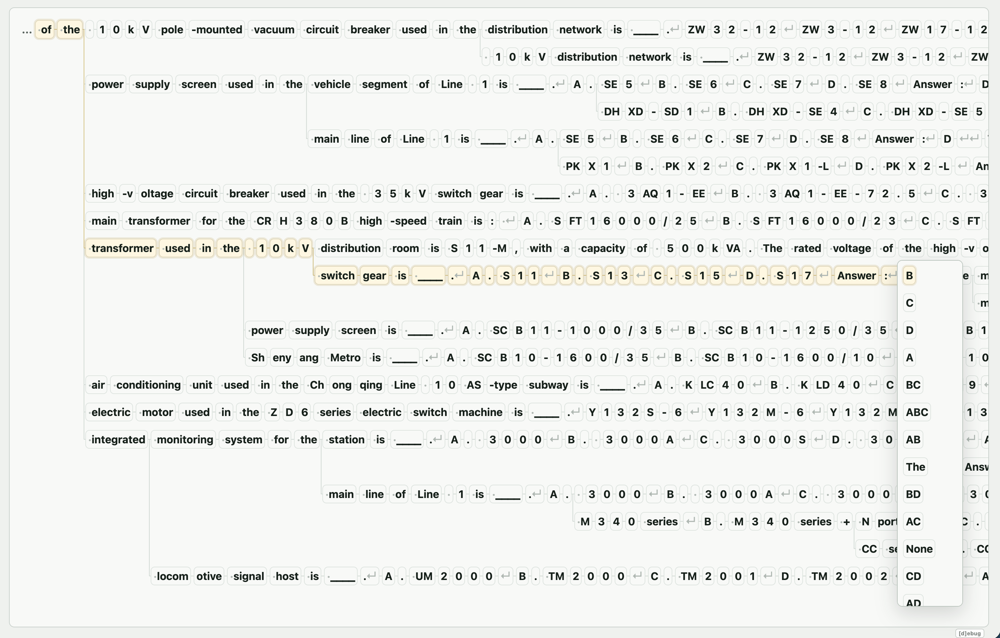
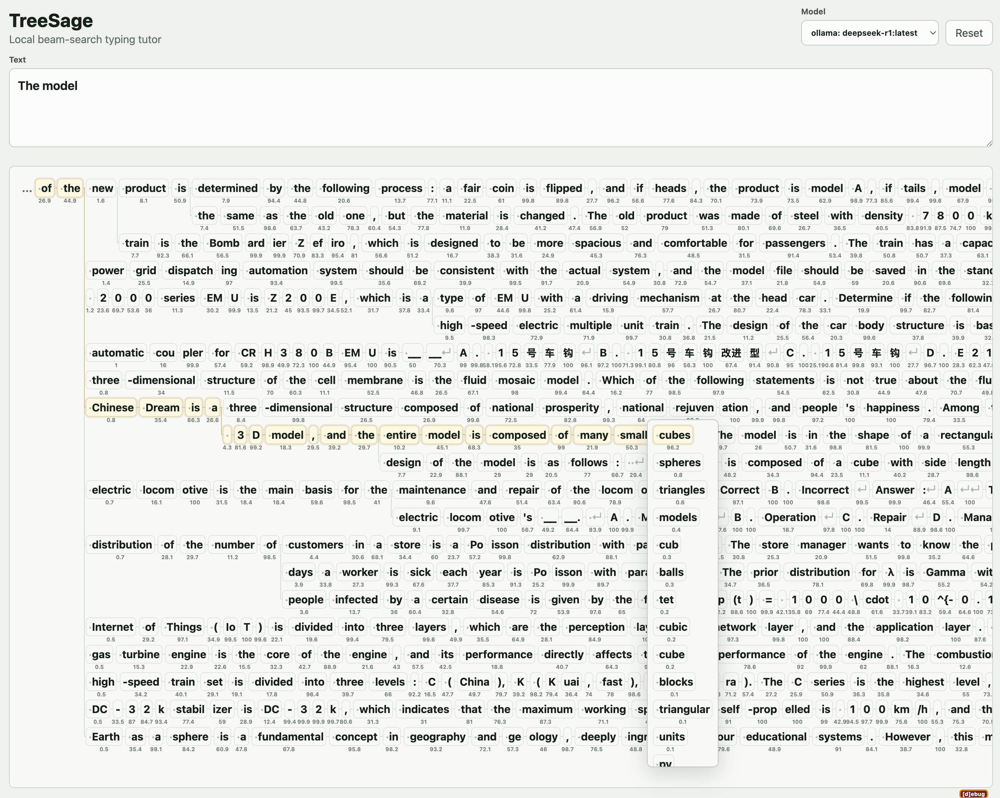
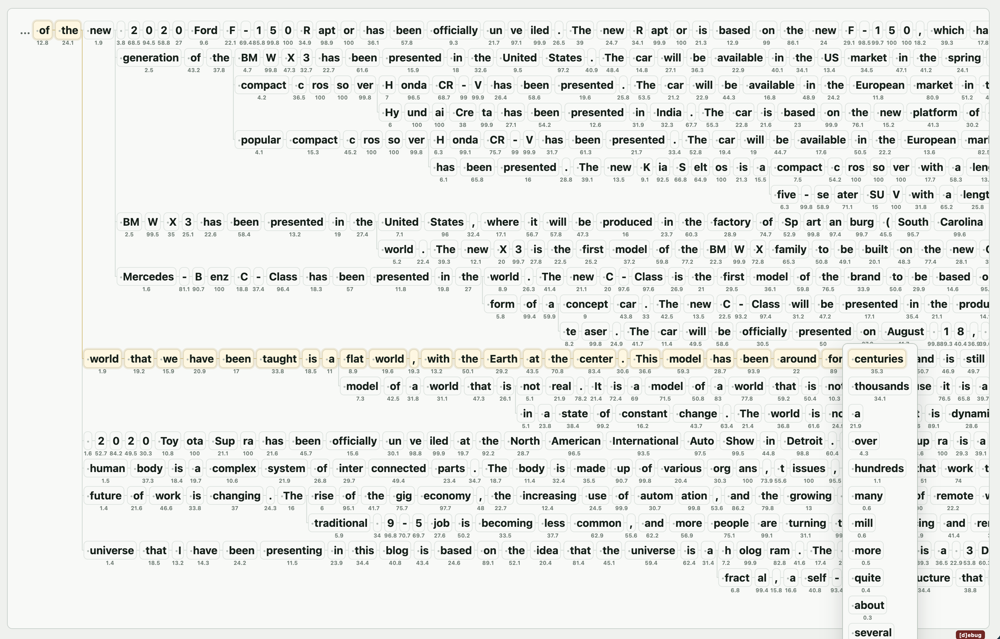

# TreeSage

TreeSage is a local-first experiment in LLM interaction design: an interface
for exploring the semantic search space implied by next-token distributions. It
runs as a SvelteKit full-stack app with Ollama for local model logprob data.

## Goal

Most LLM interfaces collapse a probabilistic policy into a single sampled
string. TreeSage makes that policy surface navigable. Given a prompt, it lays
out likely continuations as a branching next-token tree, letting a user inspect
and choose paths rather than accept implicit temperature-driven randomness. The
result is a visual tool for exploring the linguistic semantics encoded in model
weights: where models agree, where they branch, and how different local models
carve up the same prompt.

## Model Examples

The same prompt can reveal very different next-token landscapes across local
models. These examples show local models completing the prompt `"The model..."`.

| llama3.2:3b | qwen2.5:7b |
| --- | --- |
|  |  |

| deepseek-r1:latest | mistral:latest |
| --- | --- |
|  |  |

## Local Development

Install Node dependencies:

```sh
npm install
```

Start Ollama in another terminal if it is not already running:

```sh
ollama serve
```

Download at least the default local model:

```sh
ollama pull llama3.2:3b
```

Useful optional models for comparison:

```sh
ollama pull phi4:14b
ollama pull mistral:latest
ollama pull mistral-small:latest
ollama pull qwen2.5:7b
ollama pull olmo2:latest
```

Run the app:

```sh
npm run dev
```

Open the printed local URL, usually `http://127.0.0.1:5173`.

## Ollama

The app defaults to `http://localhost:11434` for Ollama. Override it with:

```sh
OLLAMA_BASE_URL=http://localhost:11434 npm run dev
```

The fake provider remains available when Ollama is not running.

The Ollama provider uses `/api/generate`, not `/api/chat`, with `raw: true`,
`temperature: 0`, `num_predict: 1`, `logprobs: true`, and `top_logprobs: 20`.

### Logprob Caveat

Ollama can struggle to return logprobs for long prompts with `phi4` and some
other models.
